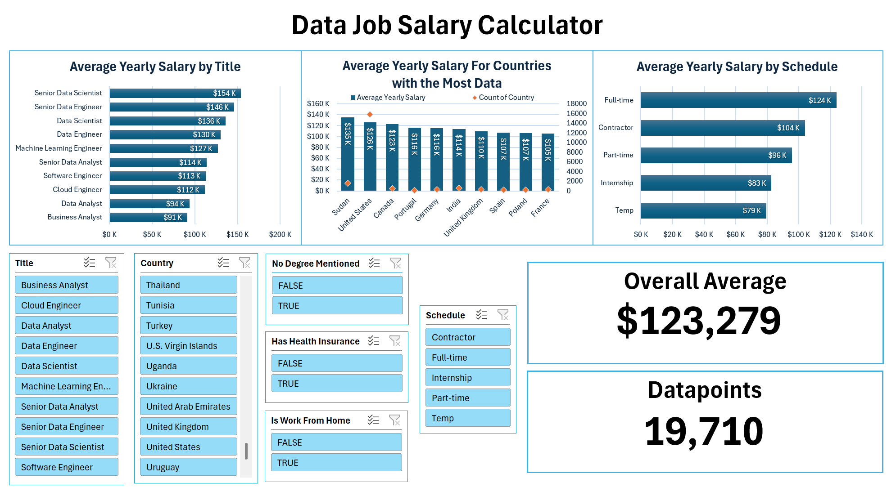
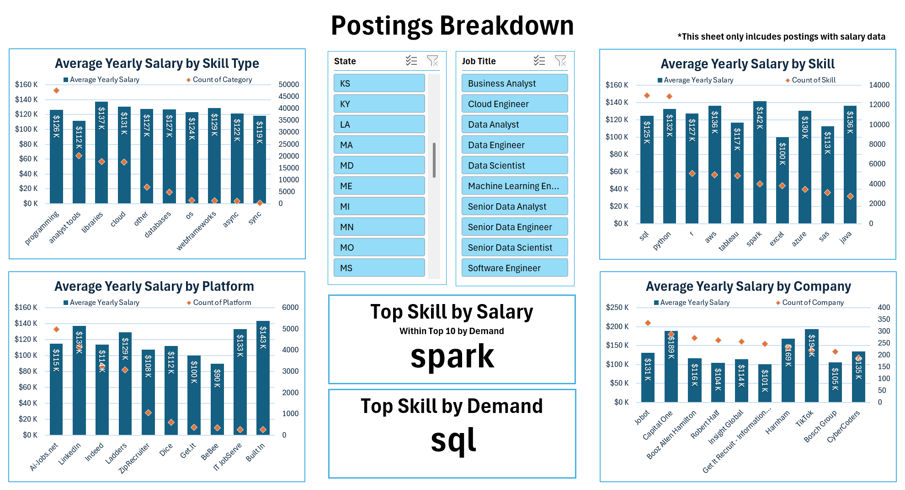

# Introduction

This is the second of four projects meant to showcase my knowledge of GitHub and various data science tools, such as Excel. For this project I worked with a dataset documenting over 1,000,000 online data job postings (data scientist, data engineer, etc.). Since my SQL analysis of this same dataset focused more on the analysis process, I wanted the Excel portion to focus on visualizing the data and making it interactable. I have created two dashboards meant to help the user understand the dataset with visualizations and key takeaways highlighted. Below you can see screenshots of the two dashboards.

# Dataset

To make the excel file function on your computer you will need to update the file paths for dataset files. Follow these steps:

1. Download the data_jobs_project.xlsx file and all four csv files from the dataset folder.
2. Open the excel file.
3. Select the Data tab at the top of the sheet.
4. Open the Get Data dropdown (far left on the ribbon) and click Data Source Settings.
5. Go through each of the four listed data sources and click the change source option in the bottom left, updating the source files to where they are locally stored on your computer (make sure you select the correct csv file).

