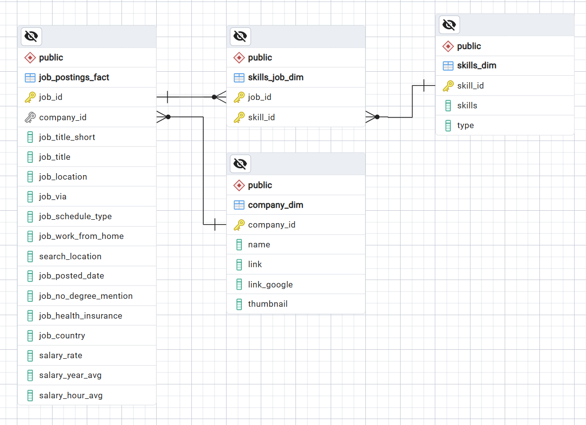
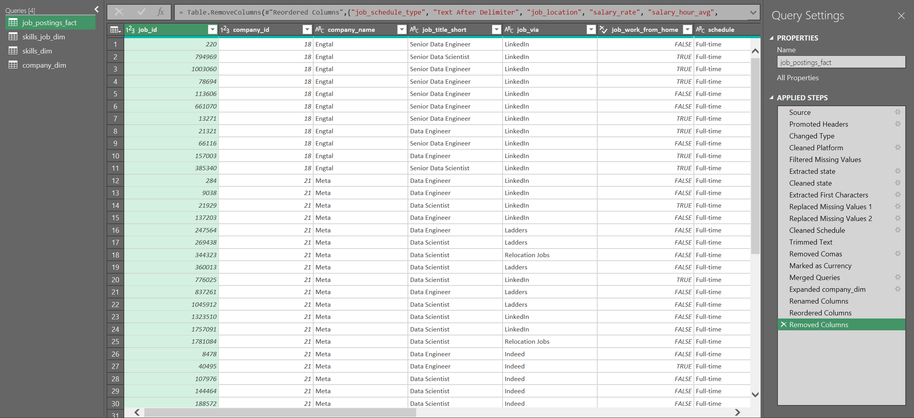
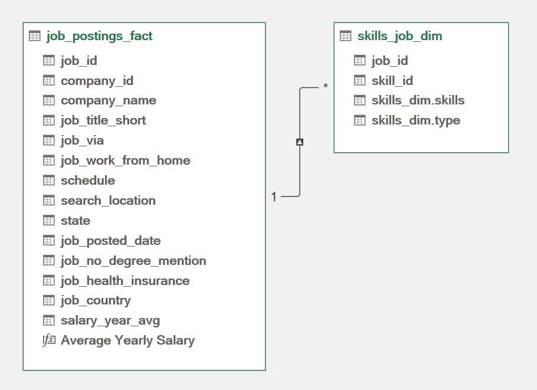
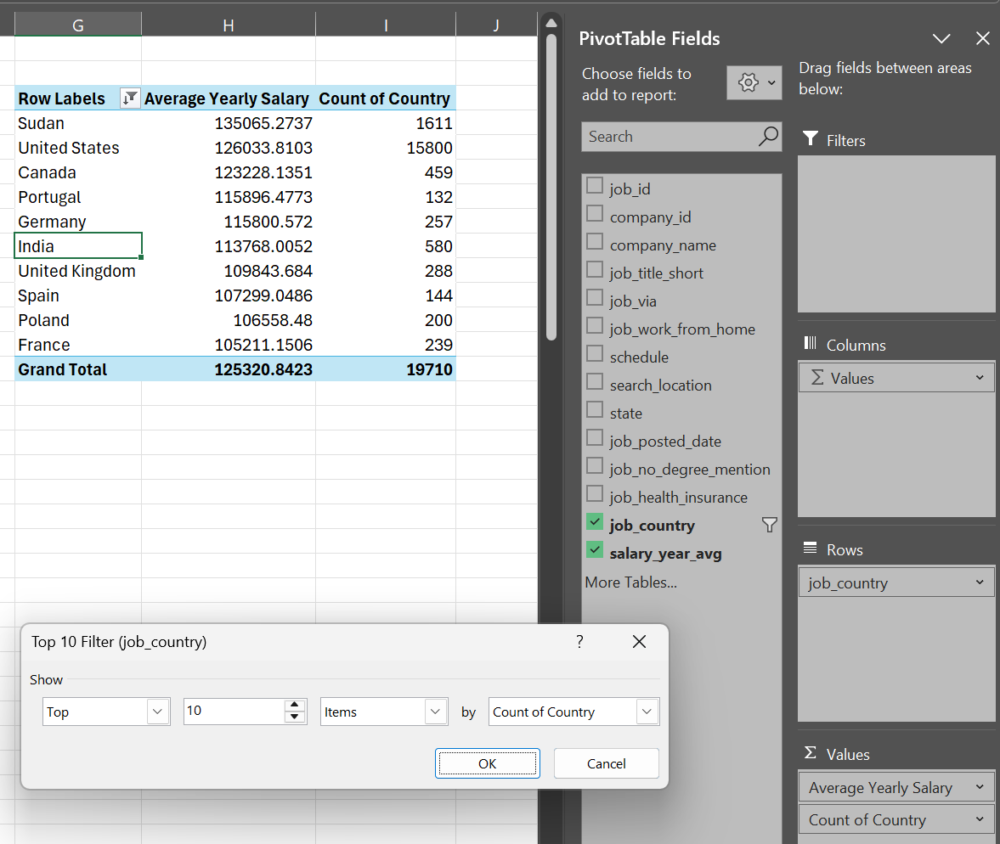
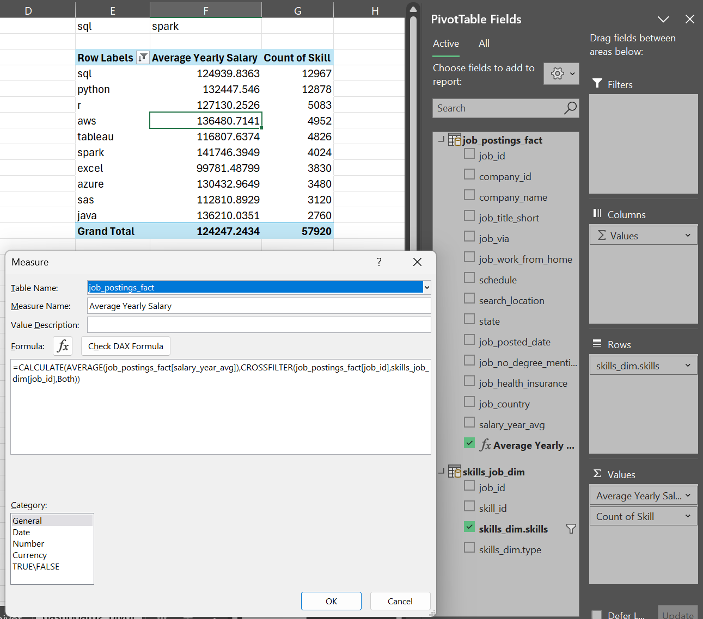
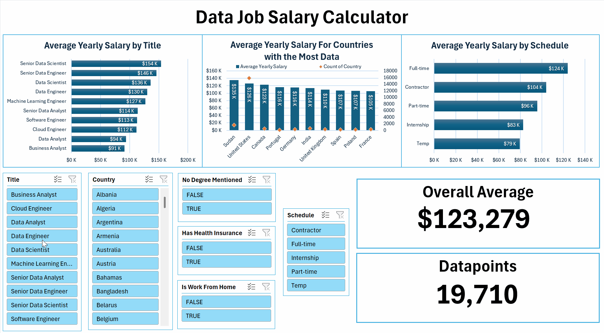
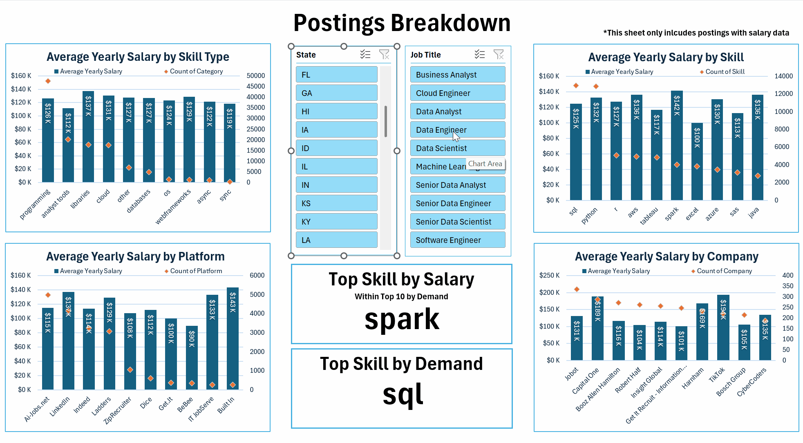

# Introduction

This is the second of four projects meant to showcase my knowledge of GitHub and various data science tools, such as Excel. For this project I worked with a dataset documenting over 1,000,000 online data job postings (data scientist, data engineer, etc.). Since my SQL analysis of this same dataset focused more on the analysis process, I wanted the Excel portion to focus on visualizing the data and making it interactable. I have created two dashboards meant to help the user understand the dataset with visualizations and key takeaways highlighted. Below you can see screenshots of the two dashboards. At the bottom of the README there is also a gif of each showcasing them being used.

# Tools Used

- **Excel**
  - **Power Query**: Used to load and transform the dataset.
  - **Data Model**: Used to create relations between tables.
  - **DAX**: Used to create a measure for the data model.
  - **Pivot Tables**: Used to analyze the dataset.
  - **Charts**: Used to visualize the results.
  - **Slicers**: Used to allow user interaction with the dashboards.
- **GitHub**: Used to document and share my Excel dashboard and analysis.

# Dataset

To make the excel file function on your computer, you will need to update the file paths for dataset files. Follow these steps: 

1. Download the data_jobs_project.xlsx file and all four csv files from the dataset folder.
2. Open the excel file.
3. Select the Data tab at the top of the sheet.
4. Open the Get Data dropdown (far left on the ribbon) and click Data Source Settings.
5. Go through each of the four listed data sources and click the "Change Source" option in the bottom left, updating the source files to where they are locally stored on your computer (make sure you select the correct csv file).

*The dataset is sourced from [Luke Barousse](https://drive.google.com/drive/folders/1egWenKd_r3LRpdCf4SsqTeFZ1ZdY3DNx).

The database, as visualized above, contains 4 tables. The largest table, _job_postings_fact_, contains the key details about each recorded job posting. It stores each posting with data such as the location of the job, whether it is a work-from-home job, the average salary, the company offering the job, and any skills needed for the job. Because the original file was above the GitHub size limit under dataset, I have uploaded a filtered version containing only rows with salary data.

The _company_dim_ table stores the companies offering each job, providing details like the company name and a link to them on Google.

The _skills_job_dim_ table is an intersection table meant to store which skills each job requires. An intersection table was necessary because jobs can have multiple skills and skills can have multiple jobs. 

The _skills_dim_ table stores the skills, providing details like the name of the skill and what type it is, such as “programming” or "analyst_tools." 

The dataset was imported from teh CSV files via power query. In the process the dataset was cleaned and transformed in a variety ways. The key changes were:

- Unused columns were deleted.
- The _skills_job_dim_ and _skills_dim_ tables, and the _job_postings_fact_ and _company_dim_ tables were merged.
- Some data was cleaned such as removing "via" from the platform column.
- The state was extracted from the rows which had state data.
- The dataset was filtered to remove rows with missing values in the salary column.

The connections were then loaded to the data model and a relationship was created on the job_id column.

# Salary Calculator

Both of the dashboards can be broken down into three major parts
- The charts
- The slicers
- The KPI (key performance indicator) cards

All three of these goals were accomplished using pivot tables. I started by creating a simple pivot table for each of the charts. Next, I inserted a chart with various visual customizations for each of the pivot tables on a different dashboard sheet. Next, I created slicers customized to report their connections to each of the pivot tables and to hide options for which there are no values. Lastly, using the `GETPIVOTDATA()` formula, I extracted the total row values from the pivot tables, which are then displayed prominently on the dashboard using text boxes.

# Postings Breakdown

The Postings Breakdown dashboard was done in a very similar way, except that because it involves data from both the job postings and the skills, I utilized a power pivot table, which is able to leverage the relationship between job_id in the data model. This allows me to create a pivot table across data tables such as calculating the average salary per skill. However, the data model relationship direction does not go in the direction to allow this calculation, so a `CROSSFILTER()` measure was used to force this calculation. The DAX code comes out to:

`=CALCULATE(AVERAGE(job_postings_fact[salary_year_avg]),CROSSFILTER(job_postings_fact[job_id],skills_job_dim[job_id],Both))`

# Conclusion

I hope that this tool can help others understand the job market of data-related jobs as applied to them, similar to the conclusion I made in the SQL project analyzing the same dataset more in-depth. With these dashboards a user should be able to analyze:

- How different factors like whether a job is work from home, the title of the job, and skill requirements impact the average salary of a job posting.
- Which skills should be focused on by salary and frequency for the job market for a specific job title within a state.
- Which companies offer the most jobs for a job title within a state, and what platforms are those jobs posted on.

# Showcase

