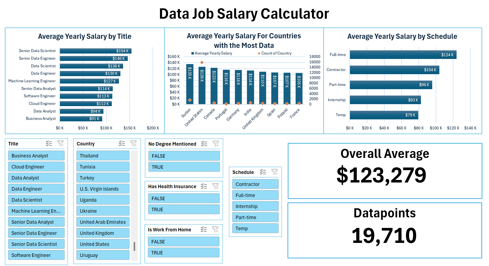
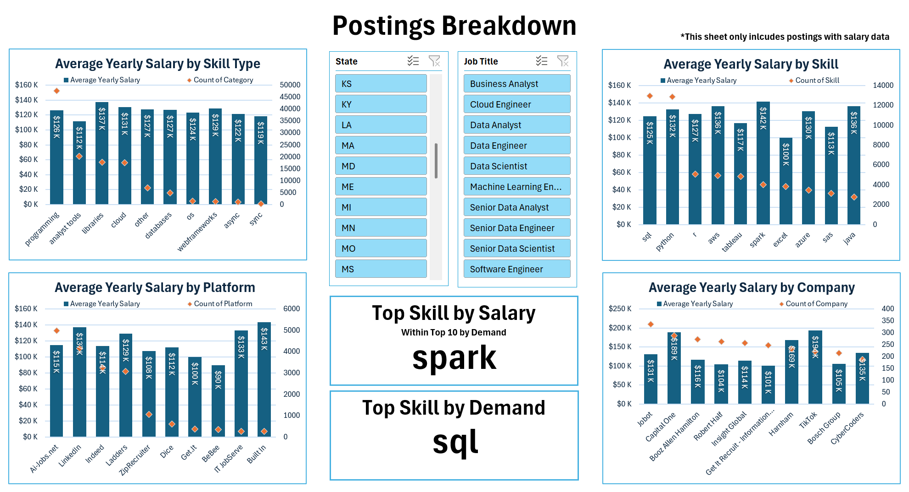
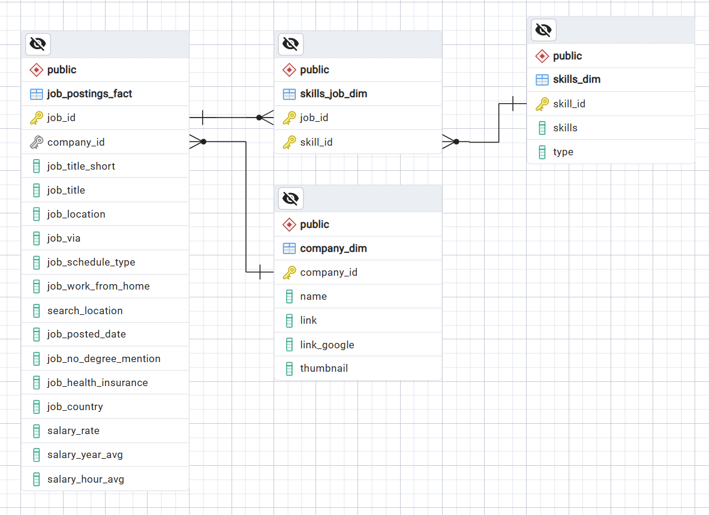
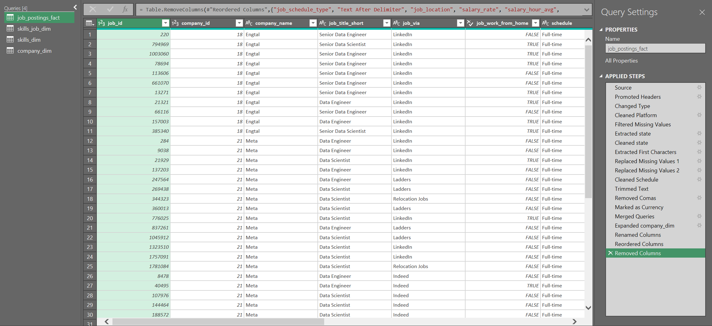
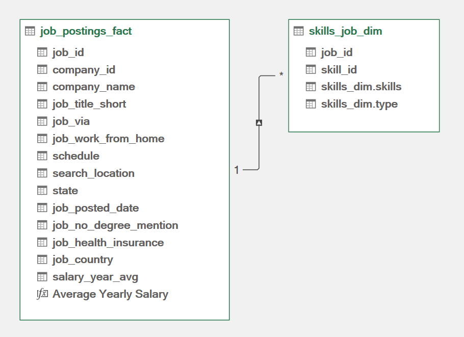
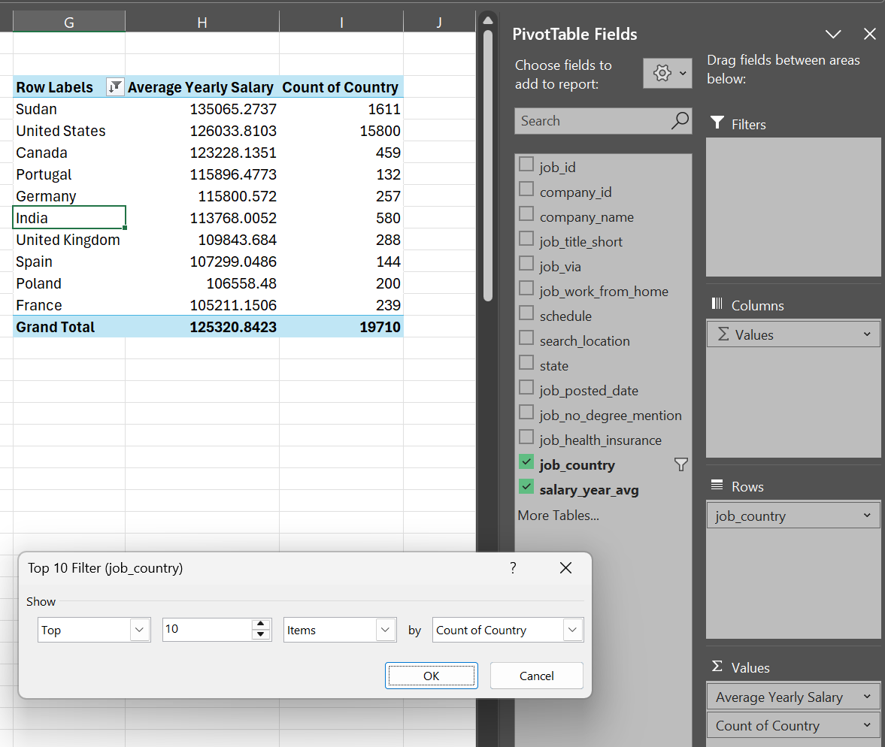
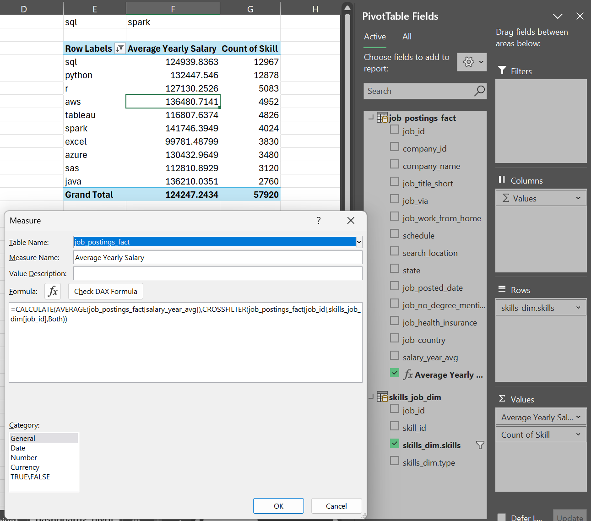
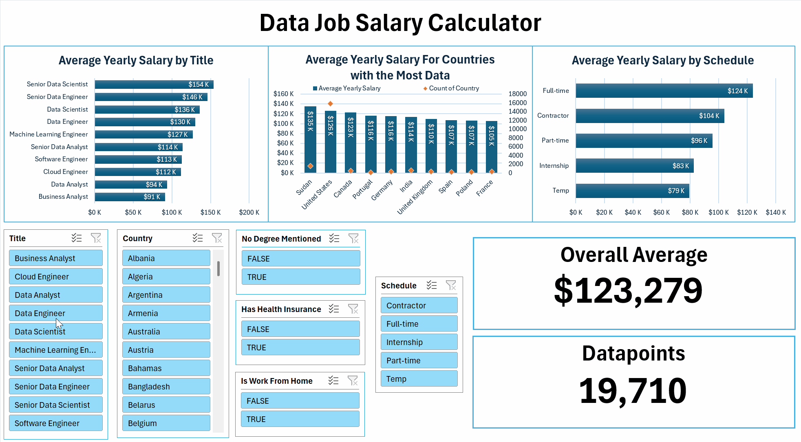
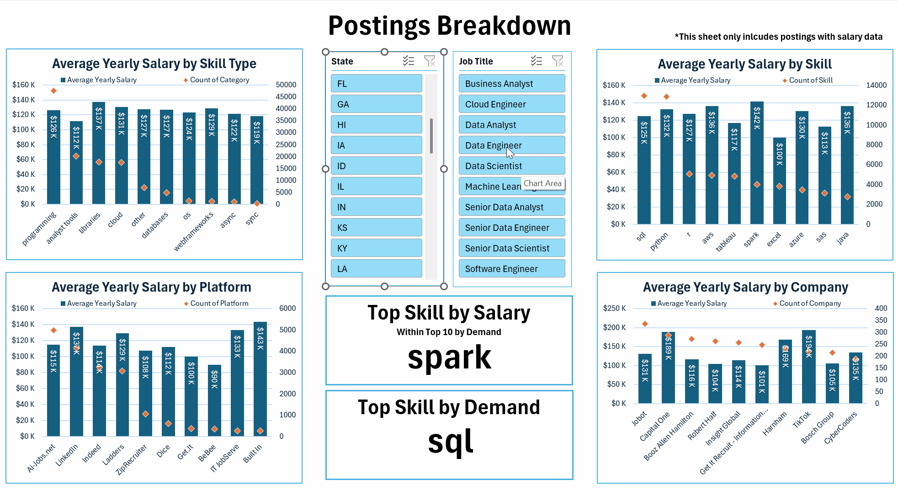

# Introduction

Welcome to my portfolio project on Excel. This project is the second of four projects meant to showcase my knowledge of the most common and important tools in data science. For this project, I worked with a relational database documenting over 1,000,000 online job postings in various data-related fields such as data science and data engineering. Since my SQL analysis of the same dataset focused on the querying and analysis process, I wanted the Excel project to focus on visualizing the data and making it interactable. I have created two dashboards meant to help the user understand the dataset with visualizations and key takeaways highlighted, so hopefully they can walk away with some of the same understandings that I came to in the SQL project as applied to them. Below are screenshots of the dashboards. At the bottom of the README are GIFs showcasing both dashboards being used.

  

  

# Tools Used

- **Excel**
  - **Power Query**: Used to load and transform the dataset.
  - **Data Model**: Used to create relations between tables.
  - **DAX**: Used to create measures to further analyze the data model.
  - **Pivot Tables**: Used to analyze the dataset.
  - **Charts**: Used to visualize the results.
  - **Slicers**: Used to allow user interaction with the dashboards.
- **GitHub**: Used to document and share my Excel dashboard and analysis.

# Dataset

To make the Excel file function on your computer, you may need to update the file paths for the dataset files by following these steps: 
1. Download the data_jobs_project.xlsx file and all four CSV files from the dataset folder.
2. Open the Excel file.
3. Select the Data tab at the top of the sheet.
4. Open the Get Data dropdown (far left on the ribbon) and click Data Source Settings.
5. Go through each of the four listed data sources and click the "Change Source" option in the bottom left, updating the source files to where they are locally stored on your computer (make sure you select the correct csv file).

  

*The dataset is sourced from [Luke Barousse](https://drive.google.com/drive/folders/1egWenKd_r3LRpdCf4SsqTeFZ1ZdY3DNx).*

The database, as visualized above, contains 4 tables. The largest table, job_postings_fact, contains the key details about each recorded job posting. It stores each posting with data such as the location of the job, whether it is a work-from-home job, the average salary, the company offering the job, and any skills needed for the job.

The company_dim table stores the companies offering each job, providing details like the company name and a link to them on Google.

The skills_job_dim table is an intersection table meant to store which skills each job requires. An intersection table was necessary because jobs can have multiple skills and skills can have multiple jobs.

The skills_dim table stores the skills, providing details like the name of the skill and what type it is, such as “programming” or "analyst_tools."

  

The dataset was imported from the CSV files via Power Query. In the process, the dataset was cleaned and transformed in a variety of ways. The key changes were:

- Unused columns were deleted.
- The skills_job_dim and skills_dim tables and the job_postings_fact and company_dim tables were merged.
- Some data was cleaned, such as removing "via" from the job platform column.
- The state was extracted from the rows that had state data and put into a separate column.
- The dataset was filtered to remove rows with missing values in the salary column since much of the analysis involved salary data.

  

The connections were then loaded to the data model, and a relationship was created on the job_id column to allow a pivot table analysis to be done across the tables.

# Salary Calculator

  

Both of the dashboards can be broken down into three major parts
- The charts
- The slicers
- The key value cards

All three of these goals were accomplished using pivot tables. I started by creating a simple pivot table for each of the charts. Next, I inserted a chart with various visual customizations for each of the pivot tables on a different dashboard sheet. The pivot tables were then filtered and sorted as needed, such as filtering to only the top 10 values. Next, I created slicers customized to report their connections to each of the pivot tables and to hide options for which there are no values. Lastly, using the `GETPIVOTDATA()` formula, I extracted the total row values from the pivot tables, which are then displayed prominently on the dashboard using text boxes.

  

# Postings Breakdown

  

The Postings Breakdown dashboard was done in a very similar way, except that because it involves data from both the job postings and the skills, I utilized a Power Pivot table, which is able to leverage the relationship on job_id in the data model. This allows me to create a pivot table across data tables such as calculating the average salary per skill. However, the data model relationship direction does not go in the direction to allow this calculation, so a `CROSSFILTER()` measure was used to force this calculation. The DAX code comes out to:

`=CALCULATE(AVERAGE(job_postings_fact[salary_year_avg]),CROSSFILTER(job_postings_fact[job_id],skills_job_dim[job_id],Both))`

  

# Conclusion

I hope that this tool can help others understand the job market of data-related jobs as applied to them, similar to the conclusions I made for myself in the SQL project. With these dashboards a user should be able to analyze:

- How different factors like whether a job is work from home, the title of the job, and skill requirements impact the average salary of a job posting.
- Which skills the user should focus on learning, based on the average salary and requirement frequency for jobs with their job title and within their state.
- Which companies offer the most jobs for their job title within their state, and what platforms are those jobs posted on.

# Showcase

  

  

